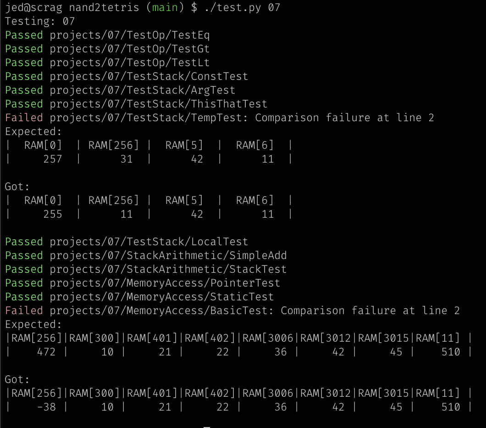

## nand2tetris

Exercises for the book, "The Elements of Computing Systems", by Nisan and Schocken, MIT Press.  

Project files downloaded from www.nand2tetris.org

### Useful Things

#### Command-line test script for vm files

In Chapter 7 files, `test.py` finds all the vm files in the current directory,
or those specified by basename, translatest them to asm, and runs all the tests
for them.

Should be easy to adapt to a different project by replacing the line `asm =
Translator(vm_filepath).translate()` with whatever works for you.

